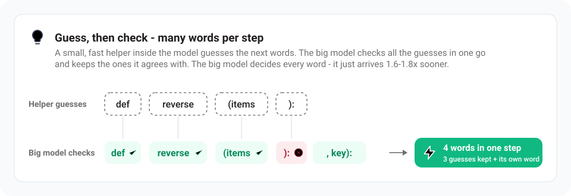

# How does Strata work?

Models like Qwen3.8-Flash-Next normally run on servers with hundreds of gigabytes of graphics memory. Your graphics
card has 12-24 GB. Strata makes it fit by **sharing the work across your whole PC** - the same idea as a kitchen, where
the things you use all the time stay on the counter and the rest waits in the pantry. Back to the
[README](../README.md#how-does-it-work).

## Who does what

- **The model is a team of 24,576 small specialists ("experts"),** and each word it writes needs only 10 of them.
  So it doesn't have to have all of them on the graphics card at once.
- **Your graphics card** does the part of the work needed for every word, and keeps the few thousand experts that
  are asked most often. It keeps learning which ones those are while you use it.
- **Your RAM** holds every expert. When a word needs one the card doesn't have, **your processor** works on it -
  at the same time as the graphics card, so neither waits for the other.
- **Your SSD** holds a big lookup table; the model only reads a few small rows of it per word.

The same in technical terms:

- **GPU (VRAM):** attention and DeltaNet mixers, the gated-residual weights, routers, shared experts, output head, the
  MTP draft layer, the KV cache (from 64K: only its most-read part, the rest streams from RAM), and an **expert
  cache** that fills the rest of VRAM with the most-used experts (it adapts to the conversation while you chat).
  More VRAM matters more than a faster GPU: every extra GB holds ~700 more experts, and every expert on the GPU is one
  the CPU does not have to compute.
- **RAM:** all 24,576 experts, pinned. The CPU computes the experts that are not on the GPU **in place**, at the same
  time as the GPU works on the cached ones (AVX-512 / AVX2 kernels, ggml's for the i-quants). On a PC with little RAM
  and a big card, the [low-RAM mode](MODELS.md#a-big-graphics-card-and-little-ram) keeps in RAM only what the GPU does
  not hold.
- **SSD:** the 28.8 GB n-gram table, read a few rows per token through the OS cache.

This works the same on NVIDIA (CUDA) and AMD (HIP) cards: the same engine, compiled for each.

## Guess, then check

- **Guess, then check.** A small, fast helper built into the model guesses the next few words, and the big model
  checks all the guesses in one go. It keeps the ones it agrees with and writes the next word itself - so one step
  often produces several words. The helper only guesses - the big model decides every word - so you get the same
  quality answer, 1.6-1.8x sooner.
- In technical terms: the model's own MTP layer drafts up to 3 tokens; one pass over all 48 layers checks them, 2.4-3.2
  tokens per pass on average. When the reply repeats the context (code edits, quoted text), **prompt lookup** drafts
  up to 5 tokens from the earlier copy, but only where its measured acceptance and cost say it pays: code edits 6-11%
  faster, other text unchanged. The drafts are checked like the MTP's, so the output is the same.

## Reading long texts

**Long texts are read in big pieces** (up to 8,192 tokens - pieces of words - at a time), which is why a long
document or code base is read at over 1,000 tokens per second. The experts of the next layer stream to the GPU over
PCIe while the current layer's attention runs. After the first message, Strata keeps the conversation and reads only
what is new, so follow-ups start in seconds.

## More

The [details](DETAILS.md#how-it-works) explain every part and its numbers, and the
[paper](paper/Strata-Paper.pdf) tells the whole story, with the measurements behind it.

## Credits

- Model: [Qwen3.8-Flash-Next](https://huggingface.co/Qwen/Qwen3.8-Flash-Next) by the Qwen team; compressed versions by
  [ISTA-DASLab](https://huggingface.co/ISTA-DASLab/Qwen3.8-Flash-Next-GSQ-RCO-GGUF);
  [Swift 1.5](https://huggingface.co/ukisai/Swift-1.5-Qwen3.8-Flash-Next-GSQ-RCO-GGUF) by UkisAI; the experimental
  [UD-Q4_K_XL](https://huggingface.co/unsloth/Qwen3.8-Flash-Next-GGUF) by Unsloth (its support follows
  [eddoursul/Strata](https://github.com/eddoursul/Strata)). Their licenses apply to the model files.
- Built with parts of [llama.cpp / ggml](https://github.com/ggml-org/llama.cpp) (MIT). Ideas from
  [Splash](https://github.com/incoai/splash), [ninfer](https://github.com/Neroued/ninfer) and
  [HyperQwen](https://github.com/syv-ai/HyperQwen). More in the [details](DETAILS.md#credits-and-licenses).
- The AMD (HIP) backend: [AMD_HIP.md](AMD_HIP.md) names the contributors and the machines it was validated on.

## License

Strata is open source under the [MIT License](../LICENSE). A few parts carry their own licenses: `third_party/ggml`
(MIT, llama.cpp / ggml), the web app's font (SIL Open Font License 1.1) and the experimental speed projection's
vector in `data/experimental-speed-projection` (Qwen Community License 1.0, from the model's activations). The
models are not part of this repository; each model's own license applies to its files.
